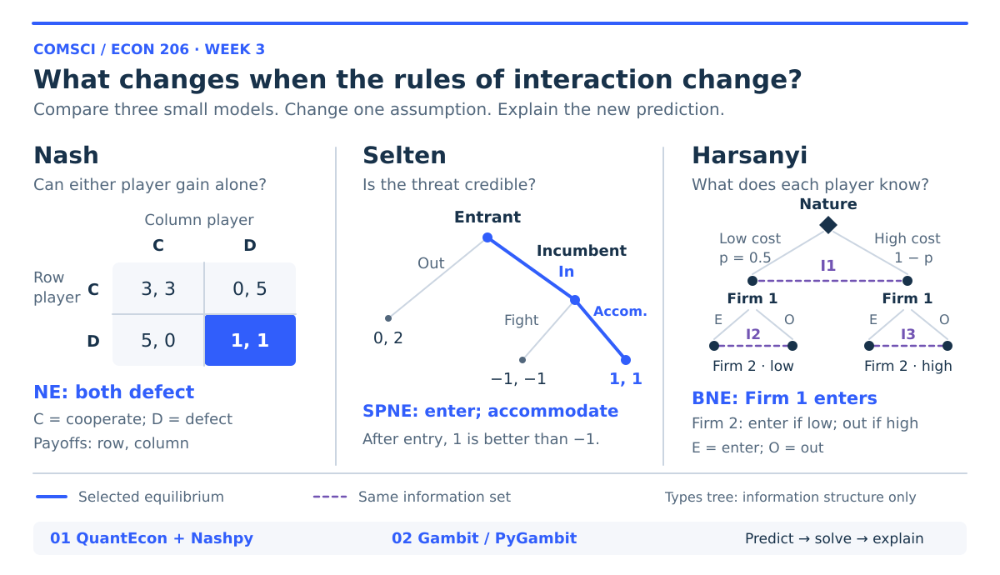
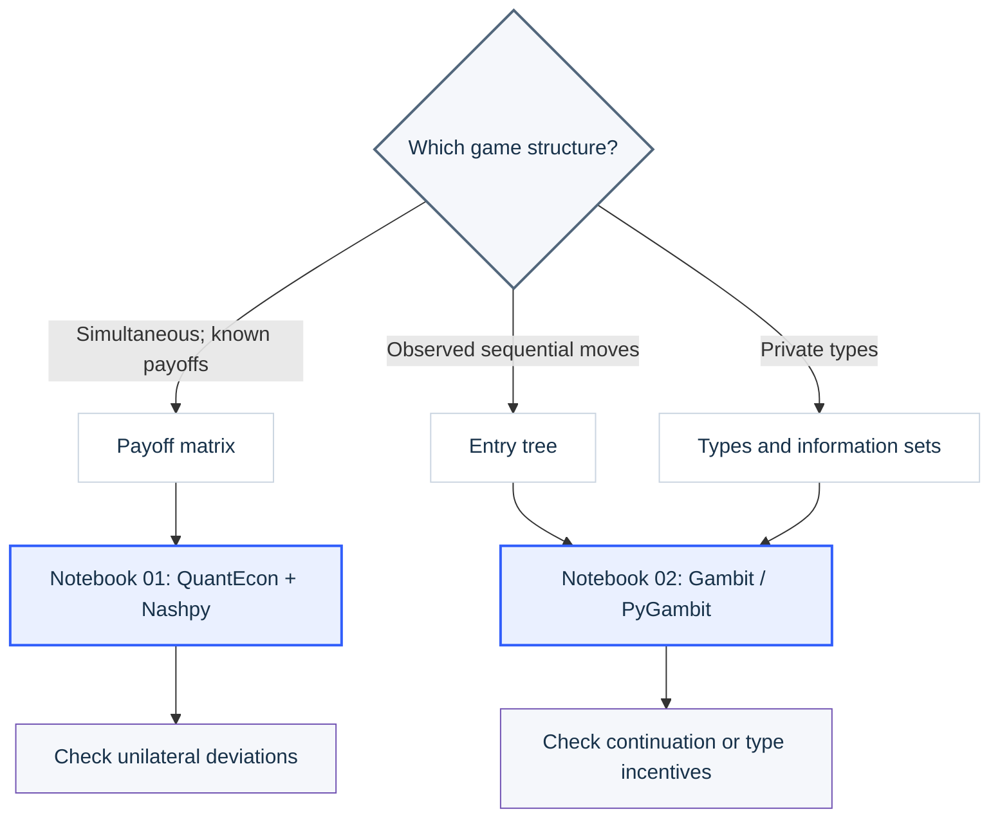
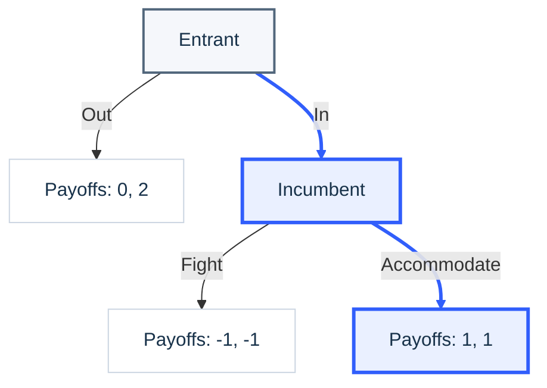
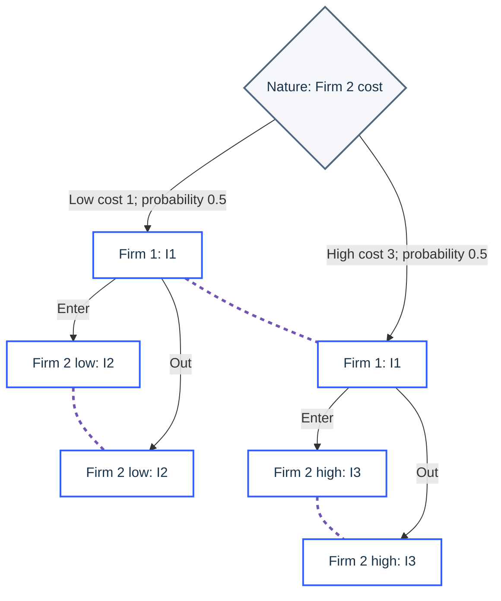

<div align="center">

# Game Theory Tools

### From Nash to Selten to Harsanyi

**COMSCI/ECON 206 · Computational Microeconomics**

Duke Kunshan University · Autumn 2026 · **Prof. Luyao Zhang**

[](docs/01_Matrix_Games_Demo.md)
[](docs/02_Trees_and_Information_Demo.md)
[](https://colab.research.google.com/github/sunshineluyao/gt-tools-demos/blob/main/notebooks/quantecon_nashpy/01_QuantEcon_Nashpy_Interactive.ipynb)
[](https://colab.research.google.com/github/sunshineluyao/gt-tools-demos/blob/main/notebooks/gambit_pygambit/02_Gambit_PyGambit_Interactive.ipynb)
[](https://github.com/sunshineluyao/gt-tools-demos/archive/refs/heads/main.zip)

[](https://github.com/sunshineluyao/gt-tools-demos/actions/workflows/notebooks.yml)

[Start teaching](#teach-directly-from-github) · [Choose a tool](#choose-a-tool) · [Game cards](#game-cards) · [Classroom guide](docs/Wednesday_UI_Demo.md) · [References & licenses](#software-and-licenses)

</div>



**Predict. Solve. Change one assumption. Explain.** Explore how timing and private information change strategic predictions, then interpret the result through economics, computer science and behavioral science. The hero compares three distinct classroom examples; complete assumptions and payoff tables appear below.

This cumulative repository contains reusable tools and notebooks. **Week 3 has exactly two notebooks**, both with saved results for classroom presentation. PS1 proposal templates and project demos belong in separate repositories.

## Teach directly from GitHub

> [!TIP]
> **Present now:** open either teaching page to show the actual saved tables, formulas and figures. **Experiment live:** open its Colab notebook, run all cells, and change the controls.

| Topic | Read-only teaching page | Executed notebook | Interactive Colab |
|---|---|---|---|
| Matrix games: QuantEcon + Nashpy | [Teach notebook 01](docs/01_Matrix_Games_Demo.md) | [View saved outputs](notebooks/quantecon_nashpy/01_QuantEcon_Nashpy_Interactive.ipynb) | [Open Colab 01](https://colab.research.google.com/github/sunshineluyao/gt-tools-demos/blob/main/notebooks/quantecon_nashpy/01_QuantEcon_Nashpy_Interactive.ipynb) |
| Trees and types: Gambit/PyGambit | [Teach notebook 02](docs/02_Trees_and_Information_Demo.md) | [View saved outputs](notebooks/gambit_pygambit/02_Gambit_PyGambit_Interactive.ipynb) | [Open Colab 02](https://colab.research.google.com/github/sunshineluyao/gt-tools-demos/blob/main/notebooks/gambit_pygambit/02_Gambit_PyGambit_Interactive.ipynb) |

Saved comparisons include coordination before/after a payoff change, an entry game before/after a credible threat, and a Bayesian game before/after changes to the prior and entry cost. All demonstration figures and outputs are embedded in the notebooks. The Markdown teaching pages provide a second GitHub viewing format.

## This week's two notebooks

| Notebook | Tool and game | What students change | Baseline check |
|---|---|---|---|
| [01 · QuantEcon + Nashpy](notebooks/quantecon_nashpy/01_QuantEcon_Nashpy_Interactive.ipynb) | Static, complete-information 2×2 games | All eight payoffs; prisoner's dilemma, matching pennies and coordination presets | Both tools agree; unilateral deviation gains are checked |
| [02 · Gambit / PyGambit](notebooks/gambit_pygambit/02_Gambit_PyGambit_Interactive.ipynb) | Matrix → sequential entry → private-cost entry | Credibility of fighting, entry payoffs, type prior and costs | Pure Nash, backward-induction SPNE and type-conditional Bayesian checks |

**Exactly two notebooks are released this week.** OpenSpiel, Axelrod, Mesa, PettingZoo, RLlib and oTree directories contain only an empty `.gitkeep` file so Git preserves the folders. They have no exercises, sample code or required installations yet.

## Run in Google Colab

1. Choose **Colab 01** or **Colab 02** above. To keep your edits, use **File → Save a copy in Drive**. Alternatively, download an `.ipynb` and use **File → Upload notebook** in [Google Colab](https://colab.research.google.com/).
2. Use a **CPU** runtime. Run the setup cell before imports, then run all cells. No API key, GPU or repository clone is required.
3. If installation asks for a restart, restart and run all cells again. PyGambit can compile from source on Linux: allow several minutes and run that setup **before class**. QuantEcon's first solver call may also take longer while routines compile.
4. Change controls and click the notebook's solve button. If widgets do not render, use the documented ordinary Python function calls. Rerun widget cells after reopening a saved notebook.
5. Notebook 02 writes `.efg` and `.nfg` files into `game_exports/`. Download them from Colab's Files sidebar for the Gambit desktop UI.

<!-- COLAB_LINKS_START -->
- [Open notebook 01 in Colab](https://colab.research.google.com/github/sunshineluyao/gt-tools-demos/blob/main/notebooks/quantecon_nashpy/01_QuantEcon_Nashpy_Interactive.ipynb).
- [Open notebook 02 in Colab](https://colab.research.google.com/github/sunshineluyao/gt-tools-demos/blob/main/notebooks/gambit_pygambit/02_Gambit_PyGambit_Interactive.ipynb).
<!-- COLAB_LINKS_END -->

The instructor supplied two earlier Colab links: [legacy notebook A](https://colab.research.google.com/drive/1QE87i6p3RR9vmYgBMTruHZ8cQy3M18oW?usp=sharing) and [legacy notebook B](https://colab.research.google.com/drive/1d4Na-1usHB7_t33ywAExP4sROUmBKftR?usp=sharing). Their contents were not accessible during this revision. They are retained for provenance; the two notebooks in this repository are the current, self-contained teaching examples.

<a id="choose-a-tool"></a>
## Choose the model, then the software



For graphical editing, use the [Gambit / GTE classroom guide](docs/Wednesday_UI_Demo.md). For learning algorithms, simulations and participant experiments, consult the [future-tool inventory](#software-and-licenses); those folders are reserved for later weeks.

| Timing × information | Representation | Concept and software choice |
|---|---|---|
| Static + complete | Payoff matrix | Nash equilibrium; Nashpy for a focused two-player entry point, QuantEcon for broader computational economics |
| Dynamic + complete | Game tree, with observed moves in our example | SPNE; build and enumerate pure Nash profiles in PyGambit, then check continuation optimality by backward induction |
| Static + incomplete | Types, common prior, type-contingent strategies; tree with information sets | Bayesian Nash equilibrium; PyGambit plus direct expected-payoff checks |
| Dynamic + incomplete | History, types, beliefs and information sets | Later refinement topics; Gambit can represent the game, but a generic Nash computation does not automatically supply the appropriate refinement |

A **tree is a representation**, not proof that moves are observed. Complete information concerns knowledge of payoff structure; perfect information concerns observation of prior moves. Our private-cost entry tree preserves simultaneous choice through information sets. Nash, Selten and Harsanyi shared the [1994 economics prize](https://www.nobelprize.org/prizes/economic-sciences/1994/summary/) for analysis of equilibria in non-cooperative games.

<a id="game-cards"></a>
## Visual game cards


### Nash · the normal-form payoff matrix

The row player chooses a row; the column player chooses a column. Each cell shows **(row payoff, column payoff)**. Both choose without seeing the other's current choice.

| Row / Column | Cooperate | Defect |
|---|---:|---:|
| Cooperate | (3, 3) | (0, 5) |
| Defect | (5, 0) | (1, 1) |

The two payoff arrays are

$$
A=\begin{pmatrix}3&0\\5&1\end{pmatrix},\qquad
B=\begin{pmatrix}3&5\\0&1\end{pmatrix}.
$$

A mixed strategy is a probability vector. Write the row strategy as $x=(x_0,x_1)$ and the column strategy as $y=(y_0,y_1)$. Their expected payoffs are

$$
u_1(x,y)=x^{\mathsf T}Ay,\qquad u_2(x,y)=x^{\mathsf T}By.
$$

A Nash equilibrium is a pair $(x^*,y^*)$ at which neither player gains by deviating alone:

$$
(x^*)^{\mathsf T}Ay^*\geq x^{\mathsf T}Ay^*\quad\text{for every }x,
$$

$$
(x^*)^{\mathsf T}By^*\geq(x^*)^{\mathsf T}By\quad\text{for every }y.
$$

**Baseline result:** both defect; the strategy vectors are $(0,1)$ and $(0,1)$; payoffs are $(1,1)$. The [saved notebook 01 results](docs/01_Matrix_Games_Demo.md) verify this statement.

### Selten · the extensive-form game tree



The thick blue route marks the baseline SPNE. Payoffs are ordered (Entrant, Incumbent). Pure Nash profiles are (Out, Fight) and (In, Accommodate). Backward induction removes the non-credible Fight threat: after entry the incumbent prefers 1 to −1, so the unique baseline SPNE is (In, Accommodate).

### Harsanyi · types and information sets



**Dashed connections identify information sets, not actions.** I1 joins Firm 1's nodes because it does not observe the cost. I2 and I3 each hide Firm 1's action from Firm 2. They remain separate because Firm 2 knows its own type. The diagram shows the information structure; the following two tables give its terminal payoffs.

Each type has its own normal-form payoff table. These tables show conditional payoffs; Firm 1 does not observe which table Nature selected.

**Low-cost type**

| Firm 1 / Firm 2 | Enter | Out |
|---|---:|---:|
| Enter | (1, 1) | (3, 0) |
| Out | (0, 3) | (0, 0) |

**High-cost type**

| Firm 1 / Firm 2 | Enter | Out |
|---|---:|---:|
| Enter | (1, −1) | (3, 0) |
| Out | (0, 1) | (0, 0) |

A Bayesian strategy is a complete plan for every type. At the baseline, Firm 2's plan is **Enter if low; Out if high**, written $s_2=(\mathrm{Enter},\mathrm{Out})$. Against that plan,

$$
\mathbb{E}[u_1(\mathrm{Enter},s_2)]
=p(2-c_1)+(1-p)(4-c_1)=3-2p.
$$

At $p=1/2$, entering yields 2 and staying out yields 0. When Firm 1 enters, low-cost Firm 2 earns $2-1=1>0$ by entering; high-cost Firm 2 earns $2-3=-1<0$ by entering and therefore stays out.

$$
\mathrm{BNE}=(\mathrm{Enter};\mathrm{Enter}\text{ if low},\mathrm{Out}\text{ if high}).
$$

Expected baseline payoffs are $(2,1/2)$. A tree is a representation: these linked information sets preserve **simultaneous choice with private costs**, not an observed sequence of actions.


## Classroom UI: Gambit and Game Theory Explorer

Use the [Wednesday walkthrough](docs/Wednesday_UI_Demo.md) with the ready-to-open files in [`examples/`](examples/). The same models are also constructed and exported inside notebook 02.

**Gambit desktop** provides an editable game tree, a strategic-form view and equilibrium profiles. Install it separately using the [official project site](https://www.gambit-project.org/); installing the `pygambit` Python package does not install the graphical application. In the desktop app, open an `.efg` file, use **Tools → Equilibrium**, and inspect **View → Profiles**. [Official GUI guide](https://gambitproject.readthedocs.io/en/stable/gui.html).

**Game Theory Explorer (GTE)** is a graphical web-based tool for creating and analyzing extensive-form game trees and strategic-form games, including Nash equilibrium computation. It is a separate open-source project, licensed **GPL-3.0**.

- Landing page: [gametheoryexplorer.org](http://www.gametheoryexplorer.org/).
- Direct builder: [gte.csc.liv.ac.uk/gte/builder](http://gte.csc.liv.ac.uk/gte/builder/).
- Source: [gambitproject/gte](https://github.com/gambitproject/gte).
- **Required citation:** Rahul Savani and Bernhard von Stengel (2015), *Game Theory Explorer – Software for the Applied Game Theorist*, Computational Management Science **12**, 5–33. [DOI](https://doi.org/10.1007/s10287-014-0206-x).

**Access note:** GTE's source repository documents a legacy Flash GUI. Live builder operation could not be verified in this environment. Preflight the supplied URLs before class; the classroom walkthrough uses Gambit desktop and exported files if GTE does not render. No Flash installation is part of this package.

<a id="software-and-licenses"></a>
## Software inventory, licenses and future folders

Upstream license texts for the listed tools are copied in [`references/licenses/`](references/licenses/); the linked upstream repositories remain authoritative. These are **software licenses**, separate from the licenses of associated papers or the instructor's original materials.

| Tool | Best fit | License / authoritative source | This release |
|---|---|---|---|
| QuantEcon.py | Computational economics; matrix games; later dynamic models | [MIT](https://github.com/QuantEcon/QuantEcon.py/blob/main/LICENSE) | Notebook 01; 0.11.4 |
| Nashpy | Transparent two-player matrix games | [MIT](https://github.com/drvinceknight/Nashpy/blob/main/LICENSE) | Notebook 01; 0.0.43 |
| Gambit / PyGambit | Finite strategic/extensive games, information sets, equilibrium algorithms | [GPL-2.0-or-later](https://github.com/gambitproject/gambit/blob/master/COPYING); [package metadata](https://pypi.org/project/pygambit/16.7.0/) | Notebook 02; 16.7.0; separate desktop UI |
| GTE | Graphical construction of small matrices and trees | [GPL-3.0](https://github.com/gambitproject/gte/blob/master/COPYING) | UI introduction and citation; live access unverified |
| OpenSpiel | Learning, search and evaluation across games | [Apache-2.0](https://github.com/google-deepmind/open_spiel/blob/master/LICENSE) | `notebooks/openspiel/` reserved |
| Axelrod-Python | Repeated prisoner's dilemma and tournaments | [MIT](https://github.com/Axelrod-Python/Axelrod/blob/dev/LICENSE.txt) | `notebooks/axelrod/` reserved |
| Mesa | Agent-based simulation | [Apache-2.0](https://github.com/projectmesa/mesa/blob/main/LICENSE) | `notebooks/mesa/` reserved |
| PettingZoo | Multi-agent environment interfaces and benchmark environments | [MIT](https://github.com/Farama-Foundation/PettingZoo/blob/master/LICENSE) | `notebooks/pettingzoo/` reserved |
| RLlib (Ray) | Scalable reinforcement learning, including multiple agents | [Apache-2.0](https://github.com/ray-project/ray/blob/master/LICENSE) | `notebooks/rllib/` reserved |
| oTree | Interactive behavioral experiments | [MIT](https://github.com/oTree-org/otree-core/blob/master/LICENSE) | `notebooks/otree/` reserved |

For future work: use OpenSpiel for game algorithms; PettingZoo for environment interfaces; RLlib for training; Axelrod for repeated-dilemma tournaments; Mesa for agent-based simulations; oTree for designed participant experiments. These are introductions to reserved tools, not executable additions this week. Consult the relevant upstream repository's citation instructions when a future notebook uses it.

<a id="references"></a>
## Papers, actual software use and required citations

These teaching examples are small original illustrations aligned with the class slides. They **do not reproduce the experiments** in the research papers below. The distinction between software papers, actual research use and tutorials is intentional.

| Software | Citation and venue | What the source supports |
|---|---|---|
| QuantEcon | Batista et al. (2024), *QuantEcon.py: A community based Python library for quantitative economics*, JOSS **9**(93), 5585. [DOI](https://doi.org/10.21105/joss.05585) | Peer-reviewed software paper describing the library; not presented as an independent adoption study |
| QuantEcon application | Sargent and Stachurski, *Markov Perfect Equilibrium*, Quantitative Economics with Python. [Worked model](https://python.quantecon.org/markov_perf.html) | Official tutorial using `nnash` for a linear-quadratic dynamic game; a later application, not a journal paper or this week's exercise |
| Nashpy | Knight and Campbell (2018), *Nashpy: A Python library for the computation of Nash equilibria*, JOSS **3**(30), 904. [DOI](https://doi.org/10.21105/joss.00904) | Software citation |
| Nashpy research use | Li, Huang, Duan, Mguni, Shao, Wang and Deng (2024), *A survey on algorithms for Nash equilibria in finite normal-form games*, Computer Science Review **51**, 100613. [DOI](https://doi.org/10.1016/j.cosrev.2023.100613); [author text](https://arxiv.org/abs/2312.11063) | §4.3/4.3.1 explicitly uses Nashpy's Lemke–Howson implementation in empirical comparisons |
| Gambit | Savani and Turocy (2026), *Gambit: The package for computation in game theory*, version 16.7.0. [Official citation instructions](https://www.gambit-project.org/cite/) | Software citation, with the version used in this release |
| Gambit research use | Gemp, Marris and Piliouras (2024), *Approximating Nash Equilibria in Normal-Form Games via Stochastic Optimization*, ICLR 2024. [Official paper](https://proceedings.iclr.cc/paper_files/paper/2024/file/420678bb4c8251ab30e765bc27c3b047-Paper-Conference.pdf) | Appendix C.1 reports comparisons using seven Gambit methods on Blotto games |
| GTE | Savani and von Stengel (2015), *Game Theory Explorer – Software for the Applied Game Theorist*, Computational Management Science **12**, 5–33. [DOI](https://doi.org/10.1007/s10287-014-0206-x); [author preprint](https://arxiv.org/abs/1403.3969) | Required software citation and worked applications of the graphical tool |

### Conceptual references

- **Nash:** John F. Nash (1950), *Equilibrium points in n-person games*, PNAS **36**(1), 48–49. [DOI](https://doi.org/10.1073/pnas.36.1.48).
- **Selten:** Reinhard Selten (1965), *Spieltheoretische Behandlung eines Oligopolmodells mit Nachfrageträgheit: Teil I: Bestimmung des dynamischen Preisgleichgewichts*, Zeitschrift für die gesamte Staatswissenschaft **121**, 301–324. [JSTOR](https://www.jstor.org/stable/40748884).
- **Harsanyi:** John C. Harsanyi (1967), *Games with incomplete information played by “Bayesian” players, I: The basic model*, Management Science **14**(3), 159–182. [DOI](https://doi.org/10.1287/mnsc.14.3.159). Part II (1968), *Bayesian equilibrium points*, **14**(5), 320–334. [DOI](https://doi.org/10.1287/mnsc.14.5.320).
- **Official APIs:** [QuantEcon game theory](https://quanteconpy.readthedocs.io/en/latest/game_theory.html), [Nashpy](https://nashpy.readthedocs.io/en/stable/), [PyGambit](https://gambitproject.readthedocs.io/en/stable/pygambit.html), [Gambit GUI equilibrium computation](https://gambitproject.readthedocs.io/en/stable/gui.nash.html), [Gambit extensive-game editing](https://gambitproject.readthedocs.io/en/stable/gui.efg.html).

Machine-readable references are in [`references/references.bib`](references/references.bib). Source locations and verification notes are in [`references/SOURCE_NOTES.md`](references/SOURCE_NOTES.md).

## Local use and verification

Python 3.12 was used for validation. Create a virtual environment, activate it, then:

```bash
python -m pip install -r requirements.txt
python -m pip install -r requirements-dev.txt
python -m unittest discover -s tests -v
```

Select that environment as your Jupyter kernel. Linux requires a C++ compiler for PyGambit; the notebook's setup cell provides a documented GNU-tool configuration. See [`docs/SETUP.md`](docs/SETUP.md).

Both notebooks have passed complete local execution and **17 model/presentation checks**. **48 math expressions** passed strict KaTeX typesetting, and **3 Mermaid diagrams** passed parsing. Actual execution records are in [`outputs/`](outputs/). The notebooks include reference outputs, parameter-editing functions and widgets. Validation uses local Python execution and callback checks; it does not claim a remote Colab browser session, a student-account access check or a live Gambit/GTE GUI test. The [GitHub Actions workflow](https://github.com/sunshineluyao/gt-tools-demos/actions/workflows/notebooks.yml) independently executes both notebooks with standard Jupyter kernels after each push; consult that run for hosted results. Independent checks cover payoff orientation, a mixed equilibrium, off-path credibility, ties and type-specific incentives. Only the named baseline packages were installed; future tools were not.

<a id="repository-map"></a>
## Repository map

| Open | What you will find |
|---|---|
| [Notebooks](notebooks/) | Two executed notebooks; future tool directories reserved |
| [Classroom guide](docs/Wednesday_UI_Demo.md) | Suggested 75-minute practice block, GUI walkthrough and exit ticket |
| [Example games](examples/) | Ready-to-open Gambit `.nfg` and `.efg` files |
| [Setup](docs/SETUP.md) | Environment and PyGambit installation guidance |
| [References](references/) | Bibliography, source notes and upstream license texts |
| [Validation](outputs/) | Actual execution records and checks |
| [Visual assets](docs/assets/README.md) | Editable hero, navigation buttons and Mermaid source files |
| [Maintenance scripts](scripts/) | Execution, teaching-page generation and reproducible graphics |

Keep future folders empty until their teaching week. Append a new notebook with a clear model, assumptions, installation cell, source/license record, editable example and independent correctness check. Update this README's inventory and `CHANGELOG.md` when releasing it.

The original teaching content has no newly selected public license in this revision; see [`LICENSE_POLICY.md`](LICENSE_POLICY.md). Upstream package licenses continue to apply to those packages. A future course-content license can be added by the instructor.
