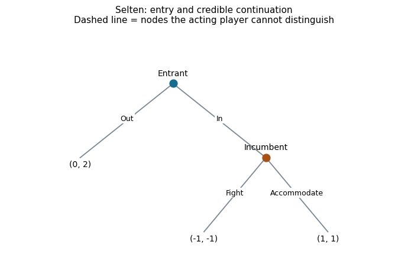
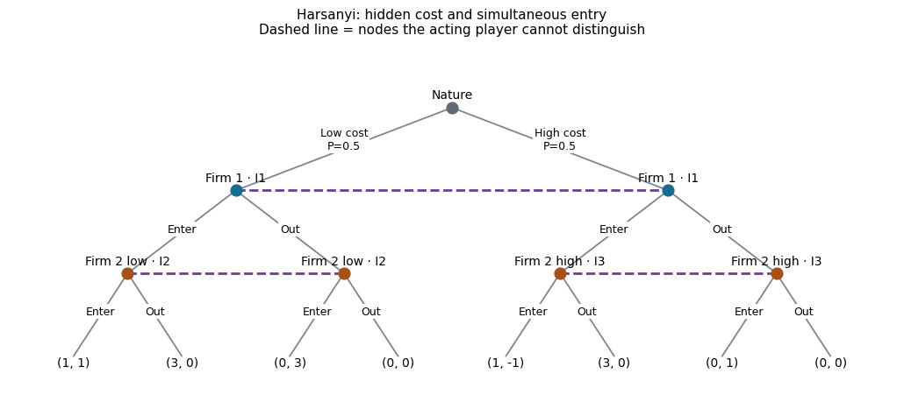
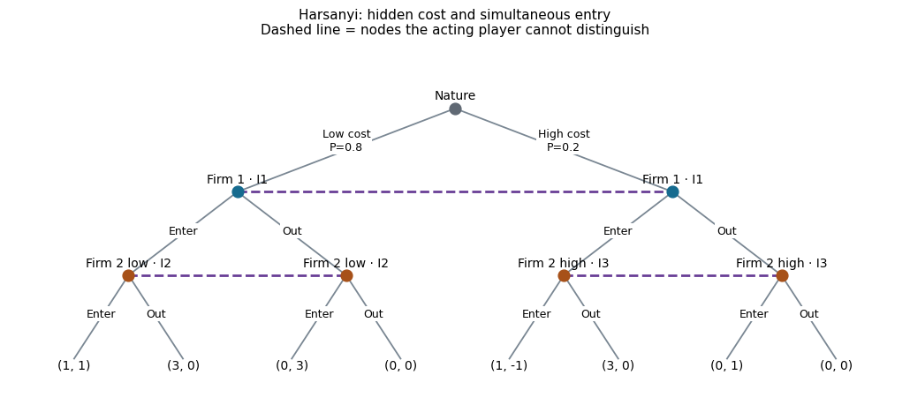

[Course home](../README.md) · [Classroom guide](Wednesday_UI_Demo.md) · [Review: matrix games](01_Matrix_Games_Demo.md)

[View annotated source and saved outputs](../notebooks/gambit_pygambit/02_Gambit_PyGambit_Interactive.ipynb)

> [!TIP]
> **Presentation mode:** actual saved notebook outputs, with code omitted. Read straight through; no installation or runtime is needed.

# 02 · From Nash to Selten to Harsanyi with Gambit / PyGambit
**COMSCI/ECON 206 · Computational Microeconomics · Autumn 2026**

**Instructor: Prof. Luyao Zhang**

Build a matrix, add a sequence of moves, then add private information.

**Run:** upload this notebook to Google Colab, select CPU, and run the setup cell first. PyGambit may take several minutes to compile on Linux. Run it before class. Then Run all. The notebook is self-contained and exports games for the separate Gambit desktop application.

| Model | Information | Question | Concept used today |
|---|---|---|---|
| Simultaneous payoff matrix | Complete | Is anyone willing to deviate alone? | Nash equilibrium |
| Entry game with observed moves | Complete; perfect observation | Is the continuation credible in every subgame? | Subgame-perfect Nash equilibrium |
| Simultaneous entry with private costs | Incomplete | Is each type choosing optimally given the prior? | Bayesian Nash equilibrium |

A tree is a **representation**. Hidden actions can make a tree represent a simultaneous game. A tree with chance is not automatically a Bayesian game: private payoff information and information sets do the work here.

**Teach without running:** the baseline and parameter-change examples below have saved tables and figures. You can read them in GitHub without installing anything. Run the notebook in Colab only to use the controls or change the code.

[Open in Colab](https://colab.research.google.com/github/sunshineluyao/gt-tools-demos/blob/main/notebooks/gambit_pygambit/02_Gambit_PyGambit_Interactive.ipynb) · [Read-only teaching page](https://github.com/sunshineluyao/gt-tools-demos/blob/main/docs/02_Trees_and_Information_Demo.md).

## 1. Nash: start with a familiar matrix
`enumpure_solve` lists pure Nash equilibria. It does not claim to list mixed equilibria. Gambit takes A and B in the usual row/column order.

|  | Row action | Row payoff | Column action | Column payoff |
| --- | --- | --- | --- | --- |
| 0 | Defect | 1.0 | Defect | 1.0 |

## 2. A small display helper
The helper below reads the game we actually construct. Purple dashed lines connect nodes in the same information set. This figure is a notebook visualization; the exported `.efg` file opens as an editable game in the Gambit desktop UI.

## Game card · extensive form and credible continuation

The entrant moves first. The incumbent **observes** entry before choosing Fight or Accommodate. Every decision node is a singleton information set: the acting player knows which node it has reached.

[Editable Mermaid tree](https://github.com/sunshineluyao/gt-tools-demos/blob/main/docs/assets/entry_game.mmd).

The same game can be written in strategic form. The incumbent's strategy specifies what it would do **if** entry occurred, including when that node is not reached.

| Entrant / Incumbent's plan after In | Fight | Accommodate |
|---|---:|---:|
| Out | (0, 2) | (0, 2) |
| In | (−1, −1) | (1, 1) |

**Pure Nash equilibria:** (Out, Fight) and (In, Accommodate).

**Backward induction:** after In, the incumbent compares $u_I(\mathrm{Accommodate})=1$ with $u_I(\mathrm{Fight})=-1$. It accommodates. Anticipating this, the entrant compares 1 with the outside payoff 0 and enters.

$$
\mathrm{SPNE}=(\mathrm{In},\mathrm{Accommodate}).
$$

The separate continuation check is essential: a general Nash solver does not automatically certify subgame perfection.

## 3. Selten: credible play after entry
Baseline: Out gives (0,2); In followed by Fight gives (−1,−1); In followed by Accommodate gives (1,1).

Predict the incumbent's choice after entry. Then work backward to the entrant. A Nash equilibrium of the whole game can contain a threat that would not be optimal if its node were reached.

We use Gambit for **pure Nash enumeration**, and a separate, transparent backward-induction function for **pure SPNE**. In tied games this function retains every pure best response; it does not enumerate all mixed SPNE.

Pure Nash equilibria of the whole game:

|  | Entrant | Incumbent after In |
| --- | --- | --- |
| 0 | Out | Fight |
| 1 | In | Accommodate |

Pure subgame-perfect Nash equilibria, checked by backward induction:

|  | Entrant | Incumbent after In |
| --- | --- | --- |
| 0 | In | Accommodate |

## Saved experiment · a credible threat

The following change has already been executed. Raising the incumbent's Fight payoff to 2 makes Fight better than Accommodate (1). The entrant anticipates −1 from entering and chooses Out. Compare the saved result with the baseline above.

Pure Nash equilibria of the whole game:

|  | Entrant | Incumbent after In |
| --- | --- | --- |
| 0 | Out | Fight |

Pure subgame-perfect Nash equilibria, checked by backward induction:

|  | Entrant | Incumbent after In |
| --- | --- | --- |
| 0 | Out | Fight |

## 4. Change the credibility of the threat
Try increasing the incumbent's Fight payoff above its Accommodate payoff. Then make those payoffs equal. Explain the difference between the entire Nash list and the SPNE list.

## Game card · private information and information sets

Firm 1's cost is $c_1=1$. Firm 2 privately knows whether its cost is $c_2=1$ (low) or $c_2=3$ (high). The common prior is $p=\Pr(c_2=1)=1/2$. Firms choose simultaneously; a sole entrant earns revenue 4, and two entrants each earn revenue 2. Out pays 0.

[Editable Mermaid information structure](https://github.com/sunshineluyao/gt-tools-demos/blob/main/docs/assets/bayesian_information_sets.mmd).

- **I1, Firm 1:** its two nodes are linked because it does not know Firm 2's cost.
- **I2, Firm 2 low:** its two low-cost nodes are linked because it does not see Firm 1's action.
- **I3, Firm 2 high:** its two high-cost nodes are linked for the same reason. I2 and I3 remain separate because Firm 2 knows its own cost.

Each type has its own normal-form payoff table. These tables show conditional payoffs; Firm 1 does not observe which table Nature selected.

**Low-cost type**

| Firm 1 / Firm 2 | Enter | Out |
|---|---:|---:|
| Enter | (1, 1) | (3, 0) |
| Out | (0, 3) | (0, 0) |

**High-cost type**

| Firm 1 / Firm 2 | Enter | Out |
|---|---:|---:|
| Enter | (1, −1) | (3, 0) |
| Out | (0, 1) | (0, 0) |

A Bayesian strategy is a complete plan for every type. At the baseline, Firm 2's plan is **Enter if low; Out if high**, written $s_2=(\mathrm{Enter},\mathrm{Out})$. Against that plan,

$$
\mathbb{E}[u_1(\mathrm{Enter},s_2)]
=p(2-c_1)+(1-p)(4-c_1)=3-2p.
$$

At $p=1/2$, entering yields 2 and staying out yields 0. When Firm 1 enters, low-cost Firm 2 earns $2-1=1>0$ by entering; high-cost Firm 2 earns $2-3=-1<0$ by entering and therefore stays out.

$$
\mathrm{BNE}=(\mathrm{Enter};\mathrm{Enter}\text{ if low},\mathrm{Out}\text{ if high}).
$$

Expected baseline payoffs are $(2,1/2)$. A tree is a representation: these linked information sets preserve **simultaneous choice with private costs**, not an observed sequence of actions.

## 5. Harsanyi: private costs and type-contingent plans
Each firm chooses Enter or Out simultaneously. Revenue is 4 if it enters alone and 2 if both enter; an entrant pays its cost. Firm 1's cost is publicly known to be 1. Firm 2's cost is 1 (low) or 3 (high), each with probability 1/2.

Nature picks Firm 2's type. Firm 1 does **not** see it. Firm 2 sees its own type but does **not** see Firm 1's action. The dashed information sets preserve those assumptions. Removing an information-set link changes the game.

A strategy for Firm 2 is a **complete plan for both types**. At the baseline, the pure Bayesian equilibrium is `(Firm 1 Enter; Firm 2 low Enter, high Out)`. Firm 1 then earns an expected payoff of 2, and Firm 2 an ex-ante expected payoff of 1/2.

Prior P(low cost) = 0.50; costs: Firm 1 = 1, Firm 2 = 1 or 3.

|  | Firm 1 | Firm 2: low | Firm 2: high | Firm 1 expected payoff | Firm 2 expected payoff |
| --- | --- | --- | --- | --- | --- |
| 0 | Enter | Enter | Out | 2.0 | 0.5 |

Every listed pure plan agrees with the independent, type-conditional deviation check.

Only PURE equilibria are enumerated here; an empty list does not rule out mixed equilibria.

## Saved experiments · change beliefs, then costs

These examples are also precomputed. With $p=0.8$ and the original costs, equilibrium actions stay the same but Firm 1's expected payoff is $3-2(0.8)=1.4$. Next raise Firm 1's cost to 3; staying Out becomes optimal, while both Firm 2 types enter.

Prior P(low cost) = 0.80; costs: Firm 1 = 1, Firm 2 = 1 or 3.

|  | Firm 1 | Firm 2: low | Firm 2: high | Firm 1 expected payoff | Firm 2 expected payoff |
| --- | --- | --- | --- | --- | --- |
| 0 | Enter | Enter | Out | 1.4 | 0.8 |

Every listed pure plan agrees with the independent, type-conditional deviation check.

Only PURE equilibria are enumerated here; an empty list does not rule out mixed equilibria.

Prior P(low cost) = 0.80; costs: Firm 1 = 3, Firm 2 = 1 or 3.

|  | Firm 1 | Firm 2: low | Firm 2: high | Firm 1 expected payoff | Firm 2 expected payoff |
| --- | --- | --- | --- | --- | --- |
| 0 | Out | Enter | Enter | 0.0 | 2.6 |

Every listed pure plan agrees with the independent, type-conditional deviation check.

Only PURE equilibria are enumerated here; an empty list does not rule out mixed equilibria.

## 6. Change uncertainty and costs
First change only the prior. A payoff or belief can change without changing the equilibrium actions. Next raise Firm 1's cost or change the high type's cost. Check incentives separately for the low and high types.

Every displayed plan is checked against direct expected-payoff inequalities. The prior stays strictly between 0 and 1; zero-probability types require additional care.

## 7. Move the same games into the classroom UI
Use the Colab **Files** sidebar to download files from `game_exports/`. No separate model needs to be typed by hand.

1. Open `entry_baseline.efg` in the **Gambit desktop application** using File → Open.
2. Identify the two decision nodes and three payoff pairs. Use **Tools → Equilibrium** to compute profiles. Use **View → Profiles** to inspect them.
3. Compare the pure profiles with the notebook's backward-induction answer. A menu that computes Nash equilibria does not by itself certify subgame perfection.
4. Open `bayesian_baseline.efg`. Locate Nature, Firm 1's linked nodes, and Firm 2's two type-specific information sets. Use **Format → Labels** if information-set labels are hidden.
5. Change a parameter in the notebook, click Rebuild and solve, download `entry_current.efg` or `bayesian_current.efg`, and reopen it in Gambit.

**GTE is a separate graphical web tool** for constructing and analyzing strategic and extensive games. Its [landing page](http://www.gametheoryexplorer.org/) and [builder](http://gte.csc.liv.ac.uk/gte/builder/) are the instructor-supplied links. Its repository documents a legacy Flash GUI, so check access before class. Use the Gambit desktop workflow if the builder does not render; no browser plug-in installation is part of this lesson. The full UI walkthrough is in `docs/Wednesday_UI_Demo.md`.

## 8. Your interdisciplinary explanation
- **Economist:** identify the incentive inequality that changed and interpret entry and welfare.
- **Computer scientist:** explain why an information set, a player label or an axis convention changes the computed problem.
- **Behavioral scientist:** propose one observable departure from the equilibrium benchmark and one way to investigate it.

**Exit ticket:** submit one changed parameter, your predicted effect, the solver output, and a two-sentence explanation. These toy models illustrate the concepts; they do not reproduce a research paper's full experiment. Dynamic games with private information, equilibrium refinements and large-scale learning tools are future topics.

## References and licenses
- Nash (1950), *Equilibrium points in n-person games*. https://doi.org/10.1073/pnas.36.1.48
- Selten (1965), *Spieltheoretische Behandlung eines Oligopolmodells mit Nachfrageträgheit: Teil I*. Zeitschrift für die gesamte Staatswissenschaft, 121, 301–324. https://www.jstor.org/stable/40748884
- Harsanyi (1967), *Games with incomplete information played by “Bayesian” players, I: The basic model*. Management Science, 14(3), 159–182. https://doi.org/10.1287/mnsc.14.3.159
- Savani, R., & Turocy, T. L. (2026). *Gambit: The package for computation in game theory*, version 16.7.0. https://www.gambit-project.org/cite/
- Research use: Gemp, I., Marris, L., & Piliouras, G. (2024). *Approximating Nash Equilibria in Normal-Form Games via Stochastic Optimization*. ICLR 2024. Appendix C.1 compares seven Gambit methods on Blotto games. [Official paper](https://proceedings.iclr.cc/paper_files/paper/2024/file/420678bb4c8251ab30e765bc27c3b047-Paper-Conference.pdf).
- Savani, R., & von Stengel, B. (2015). *Game Theory Explorer – Software for the Applied Game Theorist*. Computational Management Science, 12, 5–33. https://doi.org/10.1007/s10287-014-0206-x
- [PyGambit API](https://gambitproject.readthedocs.io/en/stable/pygambit.html) · [Gambit GUI equilibrium guide](https://gambitproject.readthedocs.io/en/stable/gui.nash.html).

**Gambit/PyGambit: GPL-2.0-or-later. GTE: GPL-3.0.** These are separate projects; installing PyGambit does not install either a desktop GUI or GTE.

---

[Course home](../README.md) · [Review: matrix games](01_Matrix_Games_Demo.md) · [Experiment in Colab](https://colab.research.google.com/github/sunshineluyao/gt-tools-demos/blob/main/notebooks/gambit_pygambit/02_Gambit_PyGambit_Interactive.ipynb)
